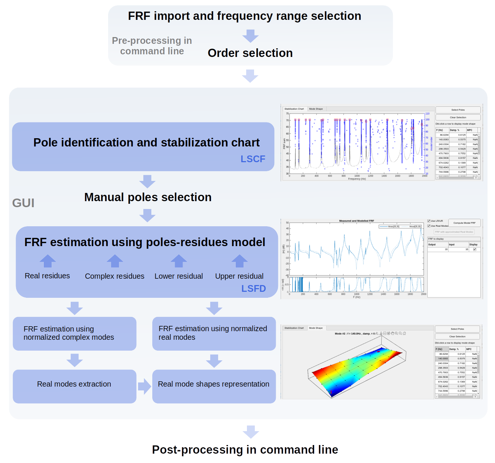

# Summary

MPIFD-MIMO is a Matlab package that provides a set of tools to
identify modal parameters of a structure using measured frequency response
functions (FRFs): frequency, modal damping, modal residues and real
normal mode shapes. The identification of poles is based on the
least-squares complex frequency-domain estimator (LSCF) using
fast-stabilizing frequency domain parameter estimation method. The
extraction of the stable poles is based on a clear stabilization chart
included in an interactive graphical user interface (GUI). The
residues identification uses the least-square frequency domain
estimator (LSFD) and can be performed using classical or non classical
damping assumption. Estimated FRFs and mode shapes can be finally
viewed in the GUI after extracting and normalizing real normal modes from residues.

# Statement of need

Experimental modal analysis [@piranda_analyse_2001] based on system identification is a key component in structural dynamics
particularly to design experimental models [@chomette_modal_2018;
@fabre_physical_2023; @fabre_dynamical_2024]. System
identification tools must be interactive to allow a "trial and error"
approach by comparing measured and estimated FRFs in a
GUI. Moreover, identification tools should allow for command-line results post-processing. The MPIFD-MIMO package was specifically designed to address these challenges.

# Statement of the field

There are many methods to identify poles in time or frequency domain. Often used in frequency domain, the
rational fraction polynomial method [@richardson_parameter_1982] in
s-domain is known to generate numerical problems when estimating high-order
models, particularly when moving from the basis of orthogonal polynomials for the modal basis. This algorithm
must therefore be applied independently on multiple frequency ranges
with a low order for each range. In time domain, the least-square
complex exponential method [@brown1979parameter] is known to generate unclear stabilization
chart. The LSCF method
[@guillaume2003poly] provides a
solution to these problems and has several advantages,
particularly the use of fast-stabilizing charts
[@van_der_auweraer_application_2001] and the
numerical stability, even over a large frequency range, which leads to
very clear stabilization diagrams. This last properties is induced by
the formulation in the z-domain which can be interpreted as a discrete frequency domain model derived from a continuous-time model.

# MPIFD-MIMO overview

The MPIFD-MIMO package is based on the following workflow:

- The user imports the complex FRFs in matrix form and selects the frequency range of
  interest using command-line.
- The user run the GUI using command-line.
- The identification of poles is performed using the LSCF algorithm in z-domain,
$z=e^{-s\Delta t}$, where $\Delta t$ denotes the sampling time and $s$
the Laplace variable respectively. The poles $p_k$ are defined with
$$
p_k=-\xi_k\omega_k+j\omega_k\sqrt{1-\xi_k^2},
$$
where $\xi_k$ and $\omega_k$ denote the modal damping factor and the
natural frequency of the $k^{st}$ mode respectively.
- The user manually selects the relevant poles on the stabilization
  chart using the interactive GUI.
- The user then triggers the estimation of the FRFs in the
poles-residues form, based on the LSFD algorithm [@amador_new_2019],
with a choice of methods:

  - Without or with lower $LR$ and upper $UR$ residual terms to
take into account the influence of out of band modes.
  - Using complex residues $r_{ijk}$ in the case of structure with non classical
 damping,
$$
H_{ij}(s)=\sum_{k=1}^{n}\left(\dfrac{{r}_{ijk}}{s-p_k}+\dfrac{{r}_{ijk}^{\ast}}{s-p_k^{\ast}}\right)+\dfrac{LR}{s^2}+UR,
$$
where $H_{ij}(s)$ is the FRF (receptance function) between sensor $i$ and
actuator $j$.
    - Complex modes $\Psi_k$ can then be identified from complex residues $r_{ijk}$.
    - Real normal modes $\phi_k$ can then be approximated from normalized complex mode $\tilde{\Psi}_k$ using unit
modal mass [@balmes_new_1997]
$$
\phi_k\approx\Re\left(\tilde{\psi}_k\sqrt{2j\,\Im(p_k)}\right),
$$
where $\Re$ denotes the real part.
  - Using purely imaginary residues in the case of structure with classical
 damping,
$$
H_{ij}(s)=\sum_{k=1}^{n}\left(\dfrac{-2\Im(r_{ijk})\Im(p_k)}{s^2+2\xi_k\omega_k s+\omega_k^2}\right)+\dfrac{LR}{s^2}+UR,
$$
where $\Im$ denotes the imaginary part.
    - Real normal modes $\phi_k$ are then directly identified from purely imaginary residues
  and normalized using unit modal mass.
- The user can then display real mode shapes $\phi_k$ in the GUI.
- Finally, the user can recalculate FRF using approximated or directly
identified real normal modes to verify the validity of the
identification in the modal basis
$$
H_{ij}(s)=\sum_{k=1}^{n}\left(\dfrac{{\phi}_{ik}{\phi}_{jk}}{s^2+2\xi_k\omega_k s+\omega_k^2}\right)+\dfrac{LR}{s^2}+UR.
$$
- The user can post-process the results in command-line.

An overview of the process is described in the \autoref{fig:process}.

{ width=100% }

# Acknowledgements

This work, part of the project Ngombi, was funded by the Agence
Nationale de la Recherche (French National research agency), Grant No. ANR-19-CE27-0013-01.

# References
